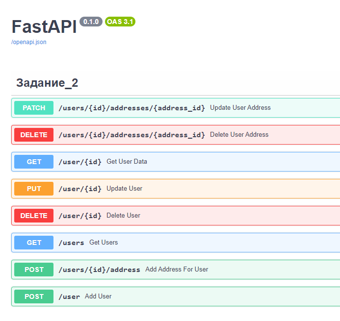
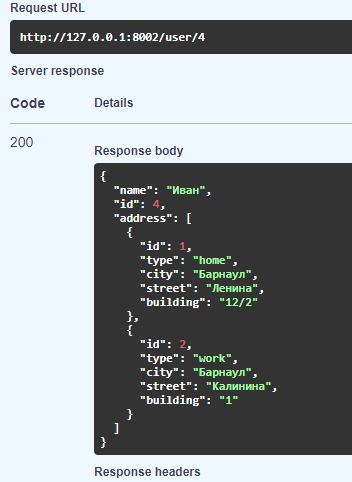

# Тестовое задание (parse dict, crud FastAPI)

[//]: # (## _Solution of a [test task]&#40;https://github.com/alexroot-coder/test_task_django_Ranks/blob/master/Тестовое_задание_для_Python_разработчика.pdf&#41;  for ООО Ранкс_)

## Клонировать репозиторий:
```sh
git clone https://github.com/alexroot-coder/test_task_SVCM_bank.git
```

## Задание 1:
По заданному ID=1024 получить значение (ключ 'value') объекта с этим ID (файл data.json).

Ожидаемый результат:
```json
{
    "choice_id": 2,
    "choice_ids": [
        2
    ],
    "choice_names": [
        "Ошибка в работе формы/проекта"
    ]
}
```
Решение:
```sh
py zadanie_1.py
```
## Задание 2:
Используя фреймворк FastAPI написать сервис для выполнения CRUD операция с объектом пользователем.

1. Создание пользователя;
2. Изменение атрибутов пользователя(адреса);
3. Удаление пользователя;
4. Получение информации пользователя по ИД.

Требования:
* Предусмотреть валидацию объекта;
* Выбрать корректный HTTP запрос для EP;
* СУБД может быть любая, для простоты это будет SQLlite;
* Сервис оформить в виде Dockerfile или docker-compose файла;
* Предусмотреть документацию EP используя Swagger.
## Запуск используя Docker:

```sh
docker build . -t "my-container"  
```

```sh
docker run -d -p 8000:8000 my-container
```
Проверить работу и посмотреть документацию Swagger можно адресу:

```sh
127.0.0.1:8000/docs
```
## Решение:





## FeedBack

[](https://t.me/yavamnerobot)
[](mailto:alexrozhentsev@gmail.com)


